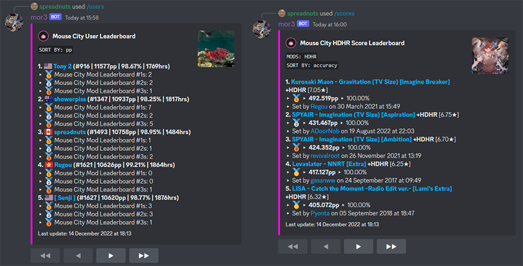
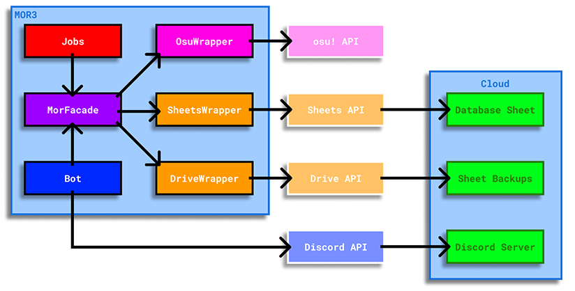

# MOR3

A Discord bot for creating localized [osu!](https://osu.ppy.sh) leaderboards.

## Features

Start your message with a slash (/) to run a command!

- **users** - display the leaderboard for currently tracked users
- **user** - display stats for a tracked user
- **scores** - display the leaderboard for all scores set by tracked users
- **leaderboard** - display the leaderboard for scores set by tracked users on a specific map
- **track** - add a user to the database and begin tracking their plays
- **submit** - manually add a score to the database
- and more! Type **/help** to see a list of all the bot's commands.



## Requirements

- A desktop platform with [Node.js](https://nodejs.org/en/download/) installed.
- The setup guide assumes that you have the [Git CLI](https://git-scm.com/) installed.

## Setup

> NOTE: If you have a sufficiently large Discord server and don't want to host locally, feel free to DM me at spreadnuts#1566 and I will setup and host an instance of the bot and database for you.

Here is a [video walkthrough](https://www.youtube.com/watch?v=UKAgohyjnhI) that follows the steps listed below.

### 1. Download MOR3 and run the setup tool

```
// Clone the repository and install dependencies
$ git clone https://github.com/mbalsdon/mor3.git
$ cd ./mor3
$ npm install

// Run the setup tool
$ npm run setup
```

### 2. Register an osu! OAuth client

1. Go to your [osu! account settings page](https://osu.ppy.sh/home/account/edit) and find the "OAuth" section.
2. Click "New OAuth Application" and give your application a name, then click "Register application".
3. Enter your client ID and client secret when the setup tool prompts you to. (NOTE: make sure not to share your client secret with anyone! Reset it if you believe it has been compromised.)

### 3. Register your Discord bot

1. Go to the [Discord Applications](https://discord.com/developers/applications) page and click "New Application" - give it a name and click "Create".
2. In the "General Information" tab, find your client/application ID. It should be a long string of numbers - enter the ID into the setup tool once prompted for it.
3. Navigate to the "Bot" tab and click "Add Bot",
4. Click "Reset Token" for your Discord bot token - copy it into the setup tool once prompted. (NOTE: make sure not to share your token with anyone! Reset it if you believe it has been compromised.)

### 4. Set up a Google Cloud service account and Google Drive folder

1. Go to the [Google Cloud Console](https://console.cloud.google.com/welcome?authuser=1) and click "Create or select a project", then click "NEW PROJECT". Give your project a name and then click "CREATE".
2. Once your project is created, select it and then click "APIs & Services". Click "ENABLE APIS AND SERVICES" and then use the search bar to find the Google Drive API. Click "ENABLE", and do the same for the Google Sheets API.
3. Once the Sheets and Drive APIs are enabled, navigate back to the "APIs & Services" page, and then click "Credentials". Click the "Manage service accounts" button, and then click "CREATE SERVICE ACCOUNT".
4. Give your service account a name and then click "CREATE AND CONTINUE". Skip the step asking you to give your service account specific roles by clicking "CONTINUE". You can also skip the step asking to grant users access to your service account by hitting "DONE".
5. Click on your service account, and then find the "KEYS" tab. Click "ADD KEY" to create a new key. Choose JSON as the format and then hit "CREATE".
6. A JSON file should be saved to your computer. Rename it to "gcp_key.json" and move it into the mor3 folder.
7. Go to your [Google Drive](https://drive.google.com/drive/u/0/my-drive) and create a folder. Right click it and press "Share", and then add your service account's email as an editor.
8. Open the folder and then copy its ID into the setup tool once prompted. The ID of your folder can be found in the URL (e.g. if the folder's URL is `https://drive.google.com/drive/u/0/folders/1OUK20m4bHM-d_a91YzMnJ71r6uJe6BXi`, then the ID of the folder is is `1OUK20m4bHM-d_a91YzMnJ71r6uJe6BXi`).

### 5. Run the bot

Once the setup tool is complete, there should be a spreadsheet in your Google Drive folder (you may have to refresh to see it). This is what will hold all of your user and score data. An empty cell is provided on the "MAIN" sheet if you want to add an image or title. If you want to fiddle with other sheet elements, make sure to run `npm run job createBackup` in case something breaks. You can also revert to earlier spreadsheet states by going to `File > Version History > See version history`.

```
// Start the bot
$ npm run start

// Run a job script manually
$ npm run job <job name>

// See list of job scripts
$ npm run job help

// The bot updates score data every 8 hours and creates a backup every 14 days.
// If you want to populate the sheet with score data immediately, track your users and then run:
$ npm run job runScheduledJobs
```

## Contributing

If you find any bugs or want to request a feature, feel free to open an [issue](https://github.com/mbalsdon/mor3). If you are reporting a bug, try to include as much detail as you can as well as steps on how to reproduce it (if possible). If you are requesting a feature, please describe the feature in as most detail as possible, as well as some use-cases for it.

While I don't expect much activity here as this is a personal project, feel free to open a pull request if you want to make any changes to the codebase that you think would be beneficial. When opening a pull request, make sure to merge into the latest release branch instead of main.

If you want to contact me directly, my DMs are open on Discord at spreadnuts#1566.

## Internals

### Overview


At its core, MOR3 essentially connects the osu!API with the Google Sheets API to create a database (backend), and then uses Discord's bot APIs to serve the data to users (frontend). For example, when you run /track from your Discord server, the bot will call `MorFacade.addSheetUser`, which will make a request to the osu! API to retrieve a user's data, and then make a request to the Google Sheets API to input the user data into the database. Both of these requests are routed through the `OsuWrapper` and `SheetsWrapper` classes which provide a more idiomatic way to deal with web requests.

The `JobHandler` class exists to manage the database. Since osu! data is mutable and continually being generated, we need to keep things clean and up-to-date. For example, every 8 hours `JobHandler` will make a call to `RunScheduledJobs`. Any new plays from tracked users will be retrieved and added to the database (again, through `MorFacade`). 

NOTE: Every 14 days, a backup for the sheet will be made through a call to `createBackup`. This is the only use for the Google Drive API at the moment.

### Directory Structure

- **mor3** - Contains the project source code. This includes `index.js`, which initializes the Discord bot and job handler, `mor_config.json`, which stores environment variables, and any external dependencies.
- **mor3/logs** - Local storage for project logs, which are deleted after 7 days.

- **mor3/src/bot** - Contains code for the Discord bot
- **mor3/src/bot/commands** - Contains functions for the Discord bot's commands

- **mor3/src/controller** - Contains backend code that works with the osu! API and Google APIs
- **mor3/src/controller/utils** - Contains custom types, enums, and general utility functions
- **mor3/src/controller/wrappers** - Contains interfaces for the osu! API and Google APIs

- **mor3/src/jobs** - Contains backend code for working with the database
- **mor3/src/jobs/jobs** - Contains the actual script code for each job

### Dependencies

- **Discord.js** - For interfacing with the Discord bot client
- **googleapis** - For interfacing with Google API clients
- **node-fetch** - For making web requests
- **node-schedule** - For scheduling job scripts
- **winston** - For generating bot and job script logs
- **winston-daily-rotate-file** - For log rotation on locally-stored logs

## Frequently Asked Questions

- **Q: What does MOR3 stand for?**
- **A**: MOR3 stands for "Mouse-Only Records 3". While it has evolved past that, the original motivation for this project was to store data from mouse-only osu! players in order to figure out who was ranked the highest and who had the best plays. Since osu! only provides game-wide leaderboards, and since a large majority of the playerbase uses tablet+keyboard or mouse+keyboard to play, for nearly a decade it was very hard to find information on mouse-only players past asking a few knowledge-holders who had been in the community for a long time or the occasional Reddit post.

- **Q: Why are you using Google Sheets as a database?**
- **A**: After looking at a few database options, I realized that Google Sheets might be my best option. I wanted a NoSQL database that was easy to work with, free, could store a large amount of data, and allowed people with little to no knowledge to look at and understand what was being stored. Of course, the main downside of using something that wasn't intended to be a database is speed, however after running a few performance tests I found that the Sheets API is more than efficient enough for a Discord bot. You may notice that some commands take upwards of \~8 seconds to run, however this is purely due to the Google API ratelimit. If you pay for a higher ratelimit (I haven't looked into this) and edit `GOOGLE_API_COOLDOWN_MS` in `mor_config.json`, you can bring command speeds down to around 1\~2 seconds.

(Also, I think it's kind of funny to tell people that I'm using a spreadsheet as a database 😋)


- **Q: Why did you write the Wrapper classes by hand when packages already exist for them?**
- **A**: I wanted to learn a bit about making web requests. Since this was a personal project more than anything, I took it as a learning experience.


- **Q: Why is the project written in pure JavaScript?**
- **A**: When I originally started this project, all of my classes at university had been done with statically-typed languages like C/C++ and Java. I chose JavaScript for this project mainly to learn the language since it is so widely used today, and so that I could gain a better understanding of dynamic typing. After going through the hell of trying to write good code with JS, I can proudly say that I will be using TypeScript from now on.
